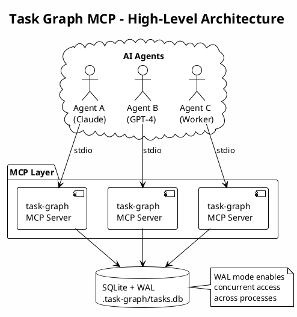
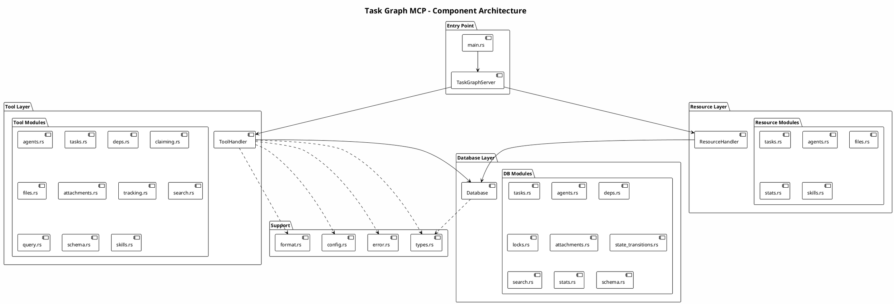
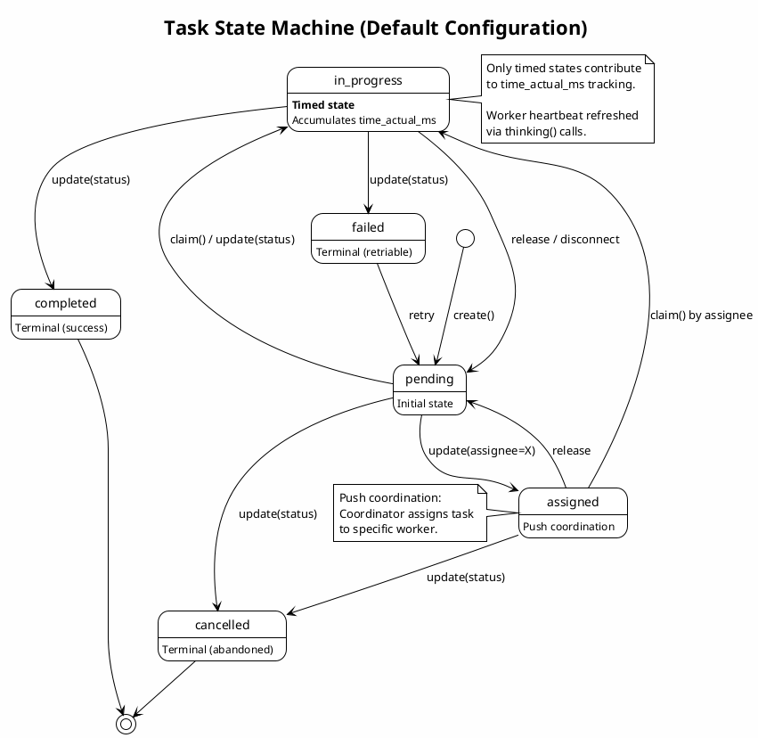
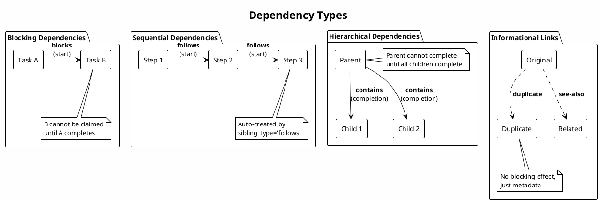
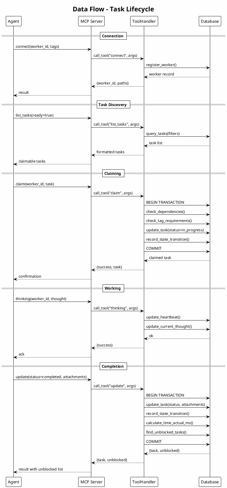
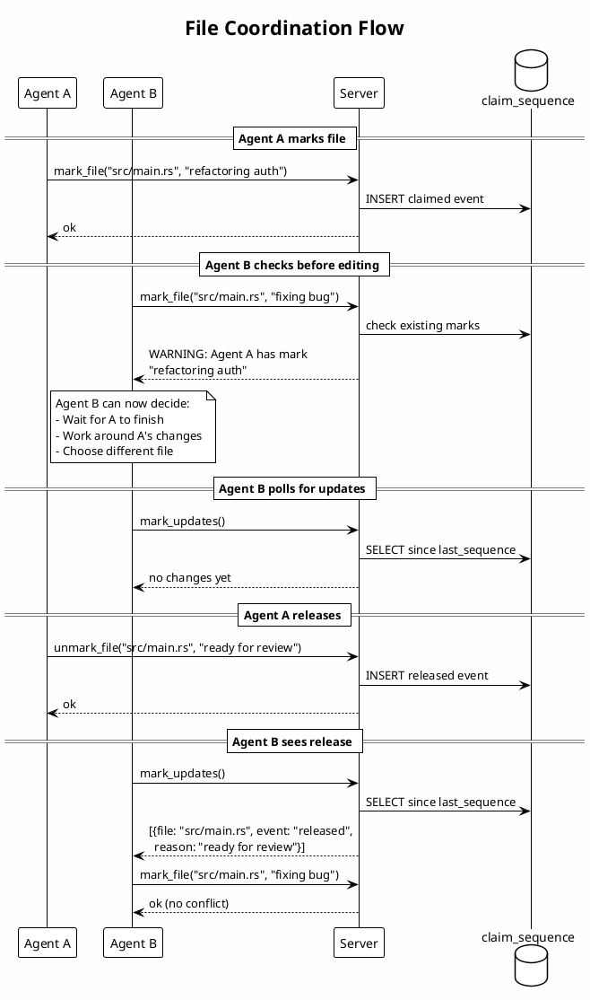
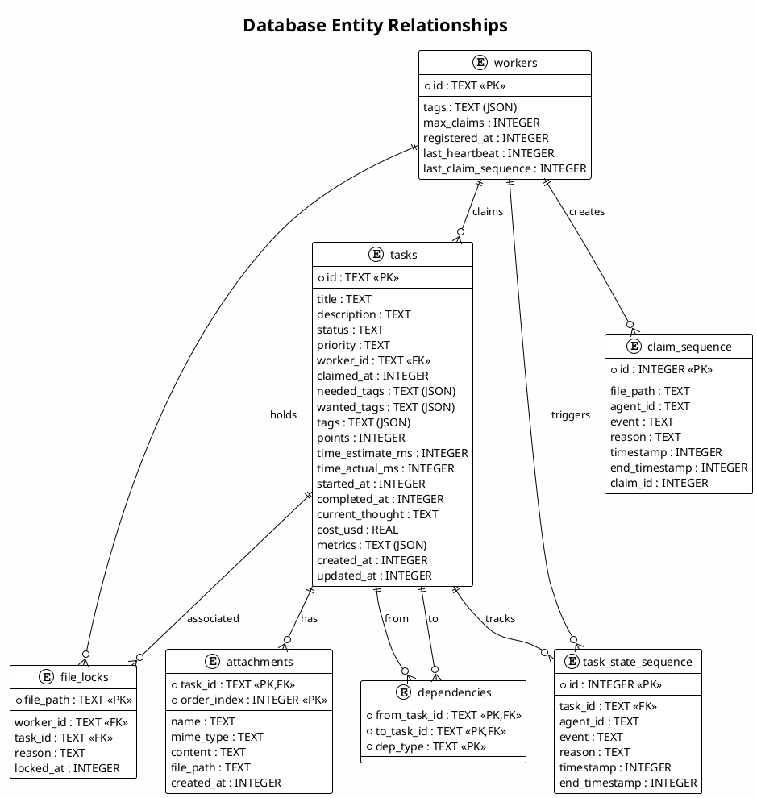

# Task Graph MCP - Design Document

> **Version:** 1.0  
> **Last Updated:** 2026-01-25  
> **Status:** Living Document

This document describes the architecture, design decisions, and implicit assumptions of the Task Graph MCP server.

---

## Table of Contents

- [Architecture Overview](#architecture-overview)
- [Component Architecture](#component-architecture)
- [Task State Machine](#task-state-machine)
- [Dependency System](#dependency-system)
- [Data Flow](#data-flow)
- [File Coordination Model](#file-coordination-model)
- [Design Decisions](#design-decisions)
- [Assumptions & Constraints](#assumptions--constraints)
- [Path Conventions](#path-conventions)

---

## Architecture Overview

Task Graph MCP is a multi-agent coordination server that enables AI agents to work together on complex tasks without conflicts. It provides:

- **Task DAG** - Hierarchical task management with typed dependencies
- **Atomic Claiming** - Prevents race conditions when agents claim work
- **File Coordination** - Advisory locks for file-level coordination
- **Cost Tracking** - Token and USD accounting per task



---

## Component Architecture

The server is organized into distinct layers:



### Layer Responsibilities

| Layer | Responsibility |
|-------|---------------|
| **Entry Point** | CLI parsing, server initialization, MCP protocol handling |
| **Tool Layer** | MCP tool definitions, parameter validation, business logic |
| **Resource Layer** | MCP resource definitions, read-only data access |
| **Database Layer** | SQLite operations, transactions, migrations |
| **Support** | Configuration, types, error handling, output formatting |

---

## Task State Machine

Tasks follow a configurable state machine. The default configuration:



### State Properties

| State | Timed | Terminal | Blocking | Description |
|-------|-------|----------|----------|-------------|
| `pending` | No | No | Yes | Initial state, waiting for claim |
| `assigned` | No | No | Yes | Assigned to specific worker (push model) |
| `in_progress` | **Yes** | No | Yes | Active work, time tracked |
| `completed` | No | Yes | No | Successfully finished |
| `failed` | No | Yes | No | Failed, can retry |
| `cancelled` | No | Yes | No | Abandoned, cannot retry |

### Auto-Advance

When enabled, tasks automatically transition from `pending` to a target state (e.g., `ready`) when their blocking dependencies are satisfied.

---

## Dependency System

Dependencies form a DAG (Directed Acyclic Graph) with typed edges:



### Dependency Properties

| Type | Display | Blocks | Use Case |
|------|---------|--------|----------|
| `blocks` | Horizontal | Start | Explicit prerequisite |
| `follows` | Horizontal | Start | Sequential execution |
| `contains` | Vertical | Completion | Parent-child hierarchy |
| `duplicate` | Horizontal | None | Mark as duplicate |
| `see-also` | Horizontal | None | Related reference |
| `relates-to` | Horizontal | None | General relationship |

### Cycle Detection

The system prevents cycles in blocking dependencies (`blocks`, `follows`, `contains`). Non-blocking links (`duplicate`, `see-also`, `relates-to`) are not checked for cycles.

---

## Data Flow



---

## File Coordination Model

Advisory file locks enable agents to coordinate without conflicts:



### Key Points

- **Advisory, not mandatory** - Marks signal intent, don't prevent access
- **Reason visibility** - Agents see *why* a file is marked
- **Polling-based** - `mark_updates()` returns changes since last call
- **Task association** - Marks can be tied to tasks for auto-cleanup

---

## Design Decisions

### Why SQLite?

| Alternative | Rejected Because |
|-------------|------------------|
| PostgreSQL | Requires server setup, network overhead |
| Redis | No persistence guarantees, complex setup |
| File-based | No concurrent access, no transactions |
| In-memory | Lost on restart |

**SQLite with WAL mode** provides:
- Zero configuration
- ACID transactions
- Concurrent readers
- Process-safe writes
- Single file deployment

### Why Configurable States?

Different workflows need different state machines:
- Simple: `pending` → `in_progress` → `completed`
- With review: Add `review` state before `completed`
- With ready queue: Add `ready` state after `pending`

### Why Typed Dependencies?

Generic "depends on" is insufficient:
- Need to distinguish blocking vs informational
- Need to support both sequence and hierarchy
- Need to allow custom workflow edges

---

## Assumptions & Constraints

### Runtime Assumptions

| Assumption | Impact | Mitigation |
|------------|--------|------------|
| **Single machine** | WAL mode assumes local filesystem | Document limitation |
| **SQLite available** | No abstraction for other DBs | Could add trait layer |
| **Filesystem access** | Media dir, log dir, config | Check permissions |
| **UTF-8 everywhere** | JSON content, file paths | Document requirement |

### Data Assumptions

| Assumption | Impact | Mitigation |
|------------|--------|------------|
| **Unix timestamps** | All times in epoch seconds | Consistent across platforms |
| **Task IDs unique** | UUID7 or user-provided | Validation on create |
| **Worker IDs unique** | User-provided or petname | Force flag for recovery |
| **JSON in TEXT** | Tags stored as JSON strings | Parse on read |

### Concurrency Assumptions

| Assumption | Impact | Mitigation |
|------------|--------|------------|
| **WAL mode enabled** | Concurrent reads, serial writes | Auto-enabled on open |
| **No distributed locking** | Single SQLite file | Document limitation |
| **Eventual consistency** | Polling-based coordination | Document latency |
| **Heartbeat timeout** | Default 5 min stale detection | Configurable |

### Security Assumptions

| Assumption | Impact | Mitigation |
|------------|--------|------------|
| **Trusted agents** | No auth/authz | Deploy in trusted environment |
| **Local filesystem** | No network exposure | Stdio transport only |
| **Read-only queries** | SQL tool restricted | Statement validation |

---

## Path Conventions

All paths in the system are **relative to the project root** unless they begin with a recognized prefix.

### Recognized Prefixes

| Prefix | Meaning | Example |
|--------|---------|---------|
| `~` | User home directory | `~/.config/app` |
| `$HOME` | User home (env var) | `$HOME/.config/app` |
| `/` | Absolute path (Unix) | `/etc/config` |
| `C:\`, `D:\`, etc. | Absolute path (Windows) | `C:\Users\config` |

### Relative Path Examples

| Path | Resolves To |
|------|-------------|
| `src/main.rs` | `{project_root}/src/main.rs` |
| `.task-graph/tasks.db` | `{project_root}/.task-graph/tasks.db` |
| `docs/README.md` | `{project_root}/docs/README.md` |

### Configuration Paths

```yaml
server:
  db_path: .task-graph/tasks.db     # Relative to project root
  media_dir: .task-graph/media      # Relative to project root
  log_dir: .task-graph/logs         # Relative to project root
  skills_dir: .task-graph/skills    # Relative to project root
```

### File Lock Paths

File marks use paths relative to project root:
```
mark_file(file="src/auth/login.rs", ...)  # Relative
mark_file(file="~/global/config", ...)    # Absolute (home)
```

---

## Appendix: Entity Relationship Diagram



---

## Document History

| Version | Date | Changes |
|---------|------|---------|
| 1.0 | 2026-01-25 | Initial design document |

---

*This document is maintained alongside the codebase. Update it when making architectural changes.*
