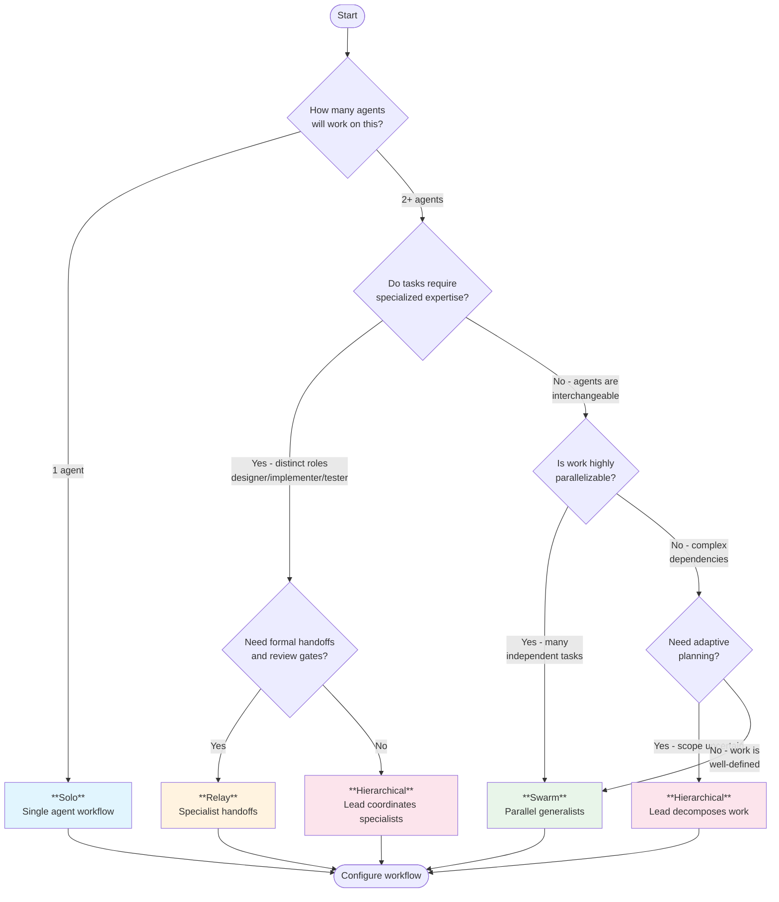

# Workflow Topologies

> **Version:** 1.0
> **Last Updated:** 2026-01-28
> **Status:** Living Document

This document describes the workflow topology system for task-graph-mcp, enabling different multi-agent coordination patterns.

---

## Workflow Dimensions

Each workflow topology is defined by these configurable dimensions:

| Dimension | Options | Description |
|-----------|---------|-------------|
| **phase_model** | `field`, `subtask` | How phases are represented |
| **coordination** | `pull`, `push`, `mixed` | How work is distributed |
| **granularity** | `coarse`, `medium`, `fine`, `mixed` | Preferred task size |
| **default_deps** | `loose`, `sequential`, `hierarchical` | Default dependency pattern |
| **agents** | `single`, `specialists`, `generalists`, `hierarchy` | Expected agent structure |

### Phase Model

- **field**: Phase is a property on the task (e.g., `phase: implement`). Good for tracking progress on a single task through multiple phases.
- **subtask**: Phases are represented as child tasks (e.g., parent "Build Feature" contains children "Design", "Implement", "Test"). Good for handoffs between specialists.

### Coordination Style

- **pull**: Workers autonomously claim available tasks using `list_tasks(ready=true)` + `claim()`. Enables maximum parallelism but requires careful dependency design.
- **push**: Coordinator assigns tasks to specific workers using `update(assignee=worker_id)`. Provides tight control but requires active orchestration.
- **mixed**: Coordinator pushes top-level tasks, workers pull subtasks. Balances control with autonomy.

### Granularity

- **coarse**: Large, self-contained tasks. One task = substantial feature. Minimal coordination overhead.
- **medium**: Moderate task size. Clear boundaries but multiple tasks per feature.
- **fine**: Small, atomic tasks. Enables fine-grained parallelism but increases coordination overhead.
- **mixed**: Variable task sizes. Top-level tasks coarse, subtasks fine.

### Default Dependencies

- **loose**: Minimal dependencies. Tasks are mostly independent, enabling parallel execution.
- **sequential**: Tasks form chains with `follows` dependencies. Ordered execution.
- **hierarchical**: Tasks nest with `contains` dependencies. Parent completion requires all children complete.

### Agent Structure

- **single**: One agent works alone. No coordination needed.
- **specialists**: Agents have distinct roles (e.g., "designer", "implementer", "tester"). Tasks flow between specialists.
- **generalists**: Agents are interchangeable. Any agent can claim any task.
- **hierarchy**: Lead agent delegates to worker agents. Mixed specialist/generalist.

---

## Preset Topologies

### Solo (workflow-solo.yaml)

Single agent working alone on a task list.

| Dimension | Value | Rationale |
|-----------|-------|-----------|
| phase_model | field | Track progress through phases on each task |
| coordination | pull | Agent claims own tasks |
| granularity | coarse | Large tasks for focused work |
| default_deps | loose | Minimal dependencies |
| agents | single | One agent |

**Best for:** Independent work, prototyping, simple projects.

### Relay (workflow-relay.yaml)

Specialists hand off work through phases like a relay race.

| Dimension | Value | Rationale |
|-----------|-------|-----------|
| phase_model | subtask | Each phase is a child task for specialist |
| coordination | push | Coordinator routes to appropriate specialist |
| granularity | medium | Right-sized for specialist focus |
| default_deps | sequential | Tasks flow with `follows` deps |
| agents | specialists | Designer, implementer, tester, etc. |

**Best for:** Formal workflows, review gates, specialized expertise.

### Swarm (workflow-swarm.yaml)

Parallel generalists working on fine-grained tasks.

| Dimension | Value | Rationale |
|-----------|-------|-----------|
| phase_model | field | Phases optional, tasks self-contained |
| coordination | pull | Workers claim available tasks |
| granularity | fine | Small atomic tasks for parallelism |
| default_deps | loose | Minimal blocking, maximum parallelism |
| agents | generalists | Any worker can claim any task |

**Best for:** Parallelizable work, large task backlogs, scaling throughput.

### Hierarchical (workflow-hierarchical.yaml)

Lead agent delegates to worker pool.

| Dimension | Value | Rationale |
|-----------|-------|-----------|
| phase_model | subtask | Lead breaks down into subtasks |
| coordination | mixed | Lead pushes, workers pull subtasks |
| granularity | mixed | Coarse top-level, fine subtasks |
| default_deps | hierarchical | `contains` for delegation |
| agents | hierarchy | Lead + worker pool |

**Best for:** Complex projects, mixed expertise, adaptive planning.

---

## Topology Comparison

```
                    Parallelism
                         ▲
                         │
              Swarm ●────┼────────────●
                    │    │            │
                    │    │            │
         ───────────┼────┼────────────┼──────────► Specialization
                    │    │            │
           Solo ●───┼────┼────────────● Relay
                    │    │
                    │    │
      Hierarchical ●─────┘
                         │
                         ▼
                    Coordination
```

### Quick Reference Table

| Topology | Parallelism | Specialization | Coordination |
|----------|-------------|----------------|--------------|
| Solo | Low | Low | None |
| Relay | Low | High | High |
| Swarm | High | Low | Medium |
| Hierarchical | Medium | Medium | High |

### Detailed Comparison

| Aspect | Solo | Relay | Swarm | Hierarchical |
|--------|------|-------|-------|--------------|
| **Team Size** | 1 agent | 3-5 specialists | 2-10+ generalists | 1 lead + 2-8 workers |
| **Best Use Case** | Prototyping, simple projects, exploration | Formal processes, compliance, quality gates | Parallelizable work, large backlogs | Complex projects, adaptive planning |
| **Task Types** | Large, self-contained features | Phase-specific work units | Small, independent atoms | Mixed: epics + subtasks |
| **Coordination Overhead** | None | High (routing) | Low-Medium (contention) | Medium (delegation) |
| **Context Sharing** | All context in one agent | Explicit handoff notes | Minimal (independent tasks) | Lead maintains big picture |
| **Scalability** | Does not scale | Limited by bottleneck roles | Scales horizontally | Scales with more workers |
| **Failure Recovery** | Single point of failure | Route around failed agent | Natural load balancing | Lead can reassign |
| **Setup Complexity** | Trivial | Requires role definitions | Minimal | Moderate |

### Pros and Cons

| Topology | Pros | Cons |
|----------|------|------|
| **Solo** | Simple mental model; Deep focus; No coordination overhead; Complete context | Single point of failure; No parallelism; Knowledge siloed; Bottleneck on large projects |
| **Relay** | Specialized expertise; Built-in review points; Clear handoff protocol; Quality gates | Sequential bottleneck; Handoff overhead; Role availability; Complex routing |
| **Swarm** | Maximum parallelism; Fault tolerant; Simple worker model; Scales easily | Context fragmentation; Potential contention; Requires decomposed tasks; Less specialization |
| **Hierarchical** | Adaptive planning; Controlled delegation; Mixed granularity; Lead oversight | Lead bottleneck; Communication overhead; More complex setup; Requires capable lead |

### When to Choose Each Topology

| Choose... | When you have... |
|-----------|------------------|
| **Solo** | One agent, simple project, or need deep exploration before scaling |
| **Relay** | Distinct skill requirements, quality/compliance needs, or formal process requirements |
| **Swarm** | Many independent tasks, need speed through parallelism, or have interchangeable agents |
| **Hierarchical** | Complex project requiring breakdown, mix of expertise levels, or uncertain scope |

---

## Configuration Schema

Workflow YAML files extend the base `workflows.yaml` with topology-specific settings:

```yaml
# Topology metadata
topology:
  name: swarm
  description: Parallel generalists with fine-grained tasks

  # Dimension values
  phase_model: field
  coordination: pull
  granularity: fine
  default_deps: loose
  agents: generalists

# Override base settings
settings:
  initial_state: pending
  # ...

# Topology-specific prompts
states:
  working:
    prompts:
      enter: |
        Swarm worker active. Claim small, atomic tasks.
        Coordinate via mark_file for shared resources.

# Role definitions (for specialist/hierarchy topologies)
roles:
  # defined per topology
```

---

## Topology Selection Flowchart

Use this decision tree to choose the right topology for your project:



### Quick Decision Guide

```
START
  |
  +-- Only 1 agent? -----------------> SOLO
  |
  +-- Need specialized roles?
  |     |
  |     +-- With formal gates? ------> RELAY
  |     +-- Without formal gates? ---> HIERARCHICAL
  |
  +-- Tasks are independent?
        |
        +-- Yes, highly parallel? ---> SWARM
        +-- No, complex deps? -------> HIERARCHICAL
```

### Key Questions Summary

| Question | If Yes | If No |
|----------|--------|-------|
| Working alone? | Solo | Continue below |
| Distinct specialist roles needed? | Relay or Hierarchical | Swarm or Hierarchical |
| Formal review gates required? | Relay | Hierarchical |
| Many independent parallel tasks? | Swarm | Hierarchical |
| Uncertain scope, need adaptive planning? | Hierarchical | Swarm |

---

## Exercising a Topology

To fully exercise a topology:

1. **Setup**: Load the workflow configuration
2. **Spawn agents**: Connect workers with appropriate tags
3. **Create task tree**: Generate realistic work items
4. **Run to completion**: Agents work through tasks
5. **Collect metrics**: Time, costs, distribution, rework

See `docs/EXPERIMENTS.md` for the experiment framework.

---

## Document History

| Version | Date | Changes |
|---------|------|---------|
| 1.0 | 2026-01-28 | Initial topology documentation |
