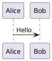

# PlantUML Diagrams

This directory contains PlantUML source files for Task Graph MCP architecture diagrams.

## Files

| File | Description |
|------|-------------|
| `architecture-overview.puml` | High-level system architecture |
| `component-architecture.puml` | Internal component structure |
| `task-state-machine.puml` | Task lifecycle state machine |
| `dependency-types.puml` | Dependency type relationships |
| `data-flow.puml` | Sequence diagram of task lifecycle |
| `file-coordination.puml` | File lock coordination flow |
| `entity-relationship.puml` | Database ER diagram |

## Rendering

### Online

Paste content into [PlantUML Online Server](https://www.plantuml.com/plantuml/uml/)

### VS Code

Install the "PlantUML" extension, then use `Alt+D` to preview.

### Command Line

```bash
# Install PlantUML
brew install plantuml  # macOS
apt install plantuml   # Ubuntu

# Render all diagrams
plantuml docs/diagrams/*.puml

# Render to PNG with specific output
plantuml -tpng -o ../images docs/diagrams/*.puml

# Render to SVG
plantuml -tsvg docs/diagrams/*.puml
```

### GitHub

GitHub renders PlantUML in markdown when using the `plantuml` code fence:

~~~markdown

~~~

## Integration with DESIGN.md

The diagrams in this directory are embedded inline in `DESIGN.md` using PlantUML code blocks. The standalone `.puml` files here allow for:

- Easier editing in IDEs with PlantUML support
- Batch rendering to images
- Version control of diagram source
